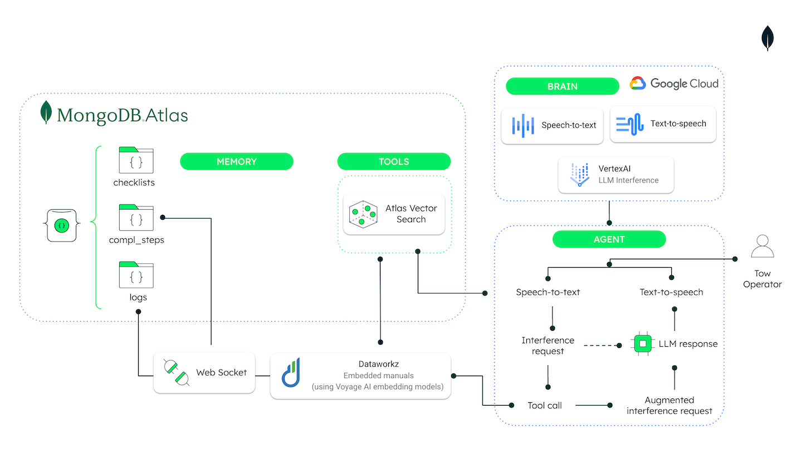

# Aircraft GroundOps Sync

This solution streamlines a synchronized aircraft ground operations data using MongoDB Atlas and Google Cloud Platform, enhanced with Dataworkz RAG (Retrieval-Augmented Generation) for intelligent data processing in NL and insights from submitted manuals to track checklist safety compliance and answer aviation questions from the tow operator.


## Prerequisites

- **Node.js 20+** - [installed](https://nodejs.org/en/download/)
- **[Next.js](https://nextjs.org/)** 
- **[MongoDB Atlas Cluster](https://www.mongodb.com/atlas)** - With Atlas admin role for your Database
- **[GCP account](https://cloud.google.com/gcp/getting-started)** with Vertex AI APIs access and [Vertex AI enabled](https://cloud.google.com/vertex-ai/docs/start/cloud-environment)
- **[Dataworkz account](https://dataworkz.com/)** (consider API Key access to your LLM of choice is needed for this step).

## Architecture




## Setup Instructions

### 1. Clone the Repository
```bash
git clone <repository-url>
cd aircraft-groundops-sync
```

### 2. Install Dependencies
```bash
npm install
```

### 3. Environment Configuration
Create a `.env.local` file with the following variables:

```
MONGODB_URI="<your-mongodb-connection-string>"
DATABASE_NAME="ground_ops_demo"
DATAWORKZ_API_KEY="your_api_key"
DATAWORKZ_SYSTEM_ID="your_system_id"
DATAWORKZ_LLM_PROVIDER_ID="your_llm_provider_id"
GCP_PROJECT_ID="<your-gcp-project-id>"
GCP_LOCATION="us-central1"
VERTEXAI_COMPLETIONS_MODEL="gemini-2.0-flash-001"
VERTEXAI_EMBEDDINGS_MODEL="text-embedding-005"
VERTEXAI_API_ENDPOINT="us-central1-aiplatform.googleapis.com"
NEXT_PUBLIC_ENV="local"
NEXT_PUBLIC_API_URL="http://localhost:3000"
```

### [ 4. Dataworkz RAG Setup](https://docs.dataworkz.com/product-docs/getting-started/what-you-will-need-prerequisites)
1. Log into your Dataworkz account
2. Create a new RAG application
3. Configure your knowledge base with aircraft operations documents
4. Note your `DATAWORKZ_SYSTEM_ID` and `DATAWORKZ_LLM_PROVIDER_ID` for the environment variables

### 5. Run the Application

#### Development
```bash
npm run dev
```

Open [http://localhost:3000](http://localhost:3000) to access the aircraft ground operations dashboard.

#### Production Build
```bash
npm run build
```

## Features

- Real-time aircraft outbound operations checklist status monitoring and completion
- Intelligent document search and retrieval via voice through RAG application
- Speech-to-text and Text-to-seech operation logging
